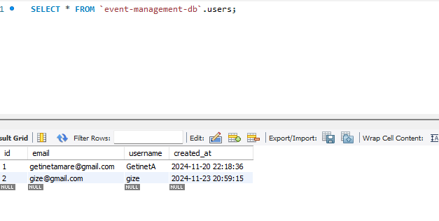

## Event Management System Backend 

First, run the development server:

```bash
npm run dev
```

Open [http://localhost:4000/api-docs/#/](http://localhost:4000/api-docs/#/) with your browser to see the following result.
## RSVS
  - Api for rsv having GET, POST methods

## Event API 
  - Has GET, PUT, POST and DELETE http methods


## Register users to event 
  - Has GET, PUT, POST and DELETE http methods

## Content generation api using Gemini AI 
  - Has GET http method to generate the text based on the prompt text


## Database Tables
- First create database called event-management-db on mysql
    ```sql
    create database `event-management-db`
    use `event-management-db`
    ```
- Create User table 
  ```sql
  CREATE TABLE users (
    id INT AUTO_INCREMENT PRIMARY KEY,
    email VARCHAR(255) NOT NULL,
    username VARCHAR(100) NOT NULL,
    created_at TIMESTAMP DEFAULT CURRENT_TIMESTAMP
  );
  ```
- Create Event table having this columns

  ```sql
  CREATE TABLE events (
      id INT AUTO_INCREMENT PRIMARY KEY,
      title VARCHAR(255) NOT NULL,
      description TEXT,
      date DATE NOT NULL,
      location VARCHAR(255),
      created_at TIMESTAMP DEFAULT CURRENT_TIMESTAMP,
      created_by INT NOT NULL,
      start_date DATETIME NOT NULL,
      end_date DATETIME NOT NULL
  );

  ```
- Create rsvps table having this columns
  ```sql
  CREATE TABLE rsvps (
    id INT AUTO_INCREMENT PRIMARY KEY,
    user_id INT NOT NULL,
    event_id INT NOT NULL,
    status ENUM('Pending', 'Accepted', 'Declined') NOT NULL,
    created_at TIMESTAMP DEFAULT CURRENT_TIMESTAMP,
    FOREIGN KEY (user_id) REFERENCES users(id),
    FOREIGN KEY (event_id) REFERENCES events(id)
  );
  ```
### Event Table
  - Has the following columns and records as of this doc prepared


### Rsv Table
  - Has the following columns and records as of this doc prepared


### User Table
  - Has the following columns and records as of this doc prepared


## Dockerfile
- we can contenerize the application using the following written dockerfile
```sh
# Use a lightweight Node.js image
FROM node:18-alpine AS base

# Install dependencies only when needed
FROM base AS deps
RUN apk add --no-cache libc6-compat
WORKDIR /app

# Copy the package manager lock files
COPY package.json yarn.lock* package-lock.json* pnpm-lock.yaml* ./
RUN \
  if [ -f yarn.lock ]; then yarn install --frozen-lockfile; \
  elif [ -f package-lock.json ]; then npm ci --legacy-peer-deps; \
  elif [ -f pnpm-lock.yaml ]; then corepack enable pnpm && pnpm install --frozen-lockfile; \
  else echo "Lockfile not found." && exit 1; \
  fi

# Rebuild the source code only when needed
FROM base AS builder
WORKDIR /app
COPY --from=deps /app/node_modules ./node_modules
COPY . .

# Build the Nuxt application
RUN \
  if [ -f yarn.lock ]; then yarn build; \
  elif [ -f package-lock.json ]; then npm run build; \
  elif [ -f pnpm-lock.yaml ]; then corepack enable pnpm && pnpm run build; \
  else echo "Lockfile not found." && exit 1; \
  fi

# Production image
FROM node:18-alpine AS runner
WORKDIR /app

ENV NODE_ENV production

# Create a non-root user for security
RUN addgroup --system --gid 1001 nodejs && adduser --system --uid 1001 nuxtjs

# Copy necessary files from the builder
COPY --from=builder /app/.output ./.output
COPY --from=builder /app/node_modules ./node_modules
COPY --from=builder /app/package.json ./

USER nuxtjs

EXPOSE 3000

ENV PORT 3000
ENV HOSTNAME "0.0.0.0"

# Verify the server directory
RUN ls -la .output/server

# Start the Nuxt server using the output directory
CMD ["node", ".output/server/index.mjs"]
```

## Go to Frontend
- **Go to frontend respository**: [https://github.com/gama1221/event-frontend](https://github.com/gama1221/event-frontend)  

## Backend Technologies
- Typescript
- Nodejs
- MySQL
- Swagger for documentation
- Docker for contenerization
## 📫 Contact Me
- **Portfolio**: [[Getinet Amare](https://getinet.netlify.app/)](https://getinet.netlify.app/)
- **Email**: [getinetamare@gmail.com](mailto:getinetamare@gmail.com)  
- **LinkedIn**: [linkedin.com/in/getinet-mekonnen](linkedin.com/in/getinet-mekonnen)  
- **GitHub**: [github.com/gama1221](github.com/gama1221)  
